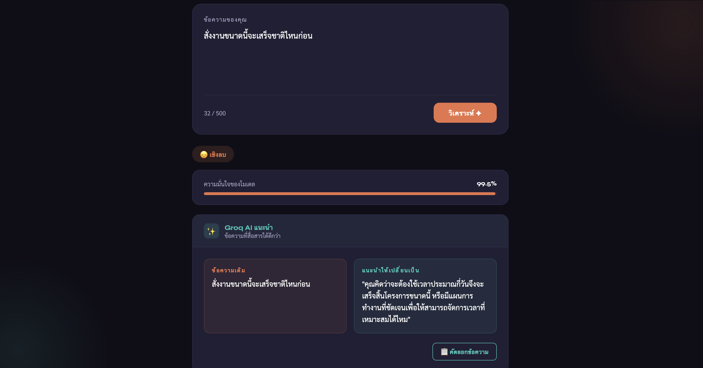

# Chatterly 💬

**Thai sentiment analysis that turns negative messages into constructive communication.**

Chatterly analyzes Thai text for sentiment using **WangchanBERTa**, and when it detects a negative or potentially confrontational message, it uses a **Groq-hosted LLM (Llama 3.3 70B)** to rewrite it into a clearer, kinder, non-aggressive version — while preserving the original intent.

> 🧑‍🤝‍🧑 **This is a team project.** It was built collaboratively; my personal contributions are described in [My Contributions](#-my-contributions) below.

---

## ✨ Key Features

- **Thai sentiment detection** — classifies text as positive / neutral / negative with a confidence score, using a fine-tuned WangchanBERTa model.
- **Constructive rewriting** — negative messages are automatically rewritten by an LLM into respectful, constructive Thai that keeps the original meaning.
- **Thai-aware NLP** — proper Thai word segmentation via PyThaiNLP before classification.
- **Simple web UI** — a clean, dark-themed single-page interface; paste a message, get instant analysis and a suggested rewrite.
- **Reproducible evaluation** — a standalone script benchmarks the model on the Wisesight Sentiment dataset (accuracy, precision, recall, F1, confusion matrix).

---

## 🧰 Tech Stack

| Layer | Technology |
|---|---|
| **Backend** | Python, Flask |
| **Sentiment model** | WangchanBERTa (`Pongsathorn/wangchanberta-base-sentiment`) via HuggingFace Transformers + PyTorch |
| **Thai tokenization** | PyThaiNLP |
| **LLM rewriting** | Groq API — `llama-3.3-70b-versatile` |
| **Frontend** | Jinja2 templates, HTML / CSS / vanilla JavaScript |
| **Evaluation** | scikit-learn, matplotlib, seaborn, tqdm |

---

## 🏗️ Architecture / How It Works

```
        User message (Thai)
                │
                ▼
   ┌────────────────────────────┐
   │  PyThaiNLP word tokenize    │   Thai has no spaces between words,
   │  (longest-matching)         │   so segment first.
   └────────────────────────────┘
                │
                ▼
   ┌────────────────────────────┐
   │  WangchanBERTa classifier   │   → pos / neu / neg  + confidence %
   └────────────────────────────┘
                │
        ┌───────┴────────┐
        │                │
   not negative       negative
        │                │
        ▼                ▼
   return result   ┌────────────────────────────┐
                   │  Groq LLM (Llama 3.3 70B)   │  Rewrite prompt asks for a
                   │  rewrite → constructive Thai │  respectful, non-aggressive
                   └────────────────────────────┘  version keeping the meaning.
                                │
                                ▼
                         JSON response
                 { sentiment, confidence, rewritten }
```

**Request flow:**
1. The frontend sends the message to `POST /analyze`.
2. The text is segmented with PyThaiNLP and classified by WangchanBERTa into `pos` / `neu` / `neg` with a confidence score.
3. **Only if the result is negative**, the original text is sent to the Groq LLM, which returns a rewritten, constructive version.
4. The API responds with the sentiment label, confidence, and the rewrite (`null` when the message isn't negative).

**Routes:** `/` (main UI) · `/analyze` (JSON API) · `/about` (project info)

---

## 📸 Screenshots

> _Screenshots of the app in action._

| Main page | Result with rewrite |
|---|---|
|  |  |

---

## 🚀 Setup & Run

### Prerequisites
- Python 3.9+
- A **Groq API key** — free from [console.groq.com](https://console.groq.com)

### 1. Clone and enter the project
```bash
git clone https://github.com/lynnx03/Chatterly.git
cd Chatterly
```

### 2. Create a virtual environment and install dependencies
```bash
python -m venv venv
# Windows
venv\Scripts\activate
# macOS / Linux
source venv/bin/activate

pip install -r requirements.txt
```

### 3. Configure your API key
Copy the example env file and add your Groq key:
```bash
cp .env.example .env
```
Then edit `.env`:
```
GROQ_API_KEY=your_real_groq_api_key
```
> `.env` is gitignored and will **never** be committed.

### 4. Run the app
```bash
python app.py
```
The first run downloads the WangchanBERTa model (a few hundred MB). Then open **http://127.0.0.1:5000**.

### (Optional) Evaluate the model
Download the Wisesight Sentiment data files, then run:
```bash
python evaluate.py
```
This prints accuracy / precision / recall / F1 and saves a confusion-matrix chart and a JSON summary.

---

## 👤 My Contributions

This was a **collaborative team project**. My personal contributions were:

- **Backend & Flask application** — built the Flask server and API layer in `app.py`: the route structure (`/`, `/analyze`, `/about`), JSON request/response handling, input validation, and wiring the sentiment and rewrite steps together into a single request flow.
- **Groq LLM rewrite feature** — designed and implemented the constructive-rewrite step: the Groq client integration, the Thai prompt engineering that instructs Llama 3.3 70B to rewrite negative messages while preserving meaning, and the logic that only triggers a rewrite when a message is classified as negative (including error handling around the API call).

Other parts of the project (including the WangchanBERTa model integration, frontend design, and evaluation tooling) were built by teammates as part of the group effort.

---

## 📄 License

Released under the [MIT License](LICENSE) © 2026 The Chatterly Team.
